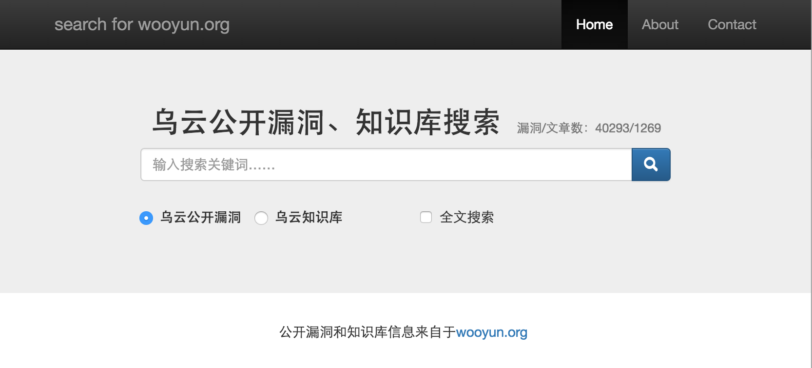

# wooyun_public 
**乌云公开漏洞、知识库爬虫和搜索**

**crawl and search for wooyun.org public bug(vulnerability) and drops**

### 1.安装相关组件
+ Python 2.7.X和pip
+ mongodb
+ scrapy (pip install scrapy)
+ Flask (pip install Flask)
+ pymongo (pip install pymongo) 

### 2.爬虫
+ **在爬取内容时，请先启动mongodb数据库：mongod &**

+ 乌云公开漏洞和知识库的爬虫分别位于目录scrapy/wooyun和scrapy/wooyun_drops

+ 运行scrapy crawl wooyun -a page_max=1  -a local_store=false -a update=false，有三个参数用于控制爬取：

    -a page_max: 控制爬取的页数，默认为1，如果值为0，表示所有页面
    
    -a local_store: 控制是否将每个漏洞离线存放到本地，默认为false
    
    -a update：控制是否重复爬取，默认为false
    
+ 第一次爬取全部内容时，用scrapy crawl wooyun -a page_max=0 -a update=true
  
+ 平时只爬取最近的更新时，用scrapy crawl wooyun -a page_max=1，可以根据自己的爬取频率和网站更新情况调整page_max的值
 
+ 全部公开漏洞的列表和每个漏洞的文本内容存在mongodb中，大概约2G内容；如果整站爬全部文本和图片作为离线查询，大概需要10G空间、2小时（10M电信带宽）；爬取全部知识库，总共约500M空间。（截止2015年10月）

### 3.搜索 
+ 漏洞搜索使用了Flask作为web server，bootstrap作为前端

+ **在搜索时，请确定已启动了mongodb数据库：mongod &**

+ 启动web server ：在flask目录下运行python app.py，默认端口是5000

+ 搜索：在浏览器通过http://localhost:5000进行搜索漏洞，多个关键字可以用空格分开。

### 4.为mongodb数据库创建索引（可选，以下为命令行操作）
	mongo
	use wooyun
	db.wooyun_list.ensureIndex({"datetime":1})
	db.wooyun_list.ensureIndex({"datetime":1,"title":1})
	db.wooyun_list.ensureIndex({"datetime":1,"html":1})
	db.wooyun_drops.ensureIndex({"datetime":1})
	db.wooyun_drops.ensureIndex({"datetime":1,"title":1})
	db.wooyun_drops.ensureIndex({"datetime":1,"html":1})

### 5.其它

+ 本程序只用于技术研究和个人使用，程序组件均为开源程序，漏洞和知识库来源于乌云公开漏洞，版权归wooyun.org

+ hancool@163.com 2015.9
